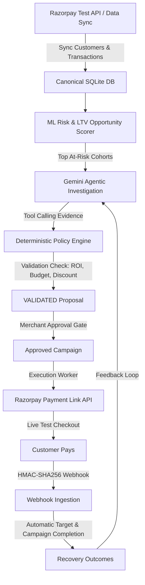

# RazorOps AI — Agentic Revenue Recovery Platform for Razorpay Merchants

> **Built for Razorpay AI Buildathon**  
> An autonomous revenue recovery operating system that identifies at-risk subscribers, investigates failed payments using Gemini 3.5 Flash Function Calling, verifies guardrails via a deterministic Policy Engine, and generates personalized Razorpay Payment Links with human-in-the-loop merchant approval.

---

## 🌟 Architecture Overview



---

## ✨ Key Features

1. **Zero-Touch Razorpay Onboarding & Sync**:
   - Secure REST API integration capturing real customers, subscriptions, and transaction failure error codes.
2. **Predictive Risk & Opportunity Scoring**:
   - Machine learning pipelines scoring churn likelihood, expected LTV, and net revenue recovery potential.
3. **Agentic Multi-Tool Investigation (Gemini 3.5 Flash)**:
   - Tool-calling agent executing `get_failed_payments`, `get_customer_context`, `get_segment_analysis`, and `get_campaign_history`.
4. **Deterministic Policy Gate**:
   - Mathematical enforcement of ROI thresholds ($\ge 2.0\times$), discount limits ($\le 15\%$), and monthly merchant recovery budget caps.
5. **Human-in-the-Loop Merchant Control**:
   - Explicit 1-click **Approve Campaign** and **Execute Campaign** flow before external Razorpay Payment Links are generated.
6. **HMAC-Verified Webhook & Closed-Loop Learning**:
   - Secure HMAC-SHA256 signature verification matching `payment_link.paid` events directly into recovery outcomes and feeding historical conversion rates back into subsequent AI reasoning cycles.

---

## 🚀 Getting Started

### 1. Prerequisites
- Python 3.11+
- Node.js 18+
- Active Razorpay Test Mode API Key & Secret
- Google Gemini API Key

### 2. Backend Setup
```bash
cd backend
python -m venv env
# On Windows:
.\env\Scripts\activate
# On Linux/macOS:
source env/bin/activate

pip install -r requirements.txt
```

Create a `.env` in the `backend/` directory:
```env
GEMINI_API_KEY=your_gemini_api_key_here
RAZORPAY_KEY_ID=your_razorpay_key_id
RAZORPAY_KEY_SECRET=your_razorpay_key_secret
RAZORPAY_WEBHOOK_SECRET=your_webhook_secret_here
```

Start the FastAPI server:
```bash
python -m uvicorn main:app --host 0.0.0.0 --port 8000 --reload
```

### 3. Frontend Setup
```bash
cd frontend
npm install
npm run dev
```

Open [http://localhost:3000](http://localhost:3000) to view the RazorOps AI Dashboard.

---

## 🔒 Security & Privacy Guardrails
- **Credential Storage**: Merchant API Key Secrets are strictly stored server-side in isolated environment files and never exposed to the frontend or git.
- **Webhook Authenticity**: Every incoming event is strictly verified using constant-time `hmac.compare_digest`.
- **Policy Enforcement**: Agent proposals cannot bypass hardcoded mathematical policy limits.

---

## 📜 License
MIT License. Built for the Razorpay AI Buildathon 2026.
